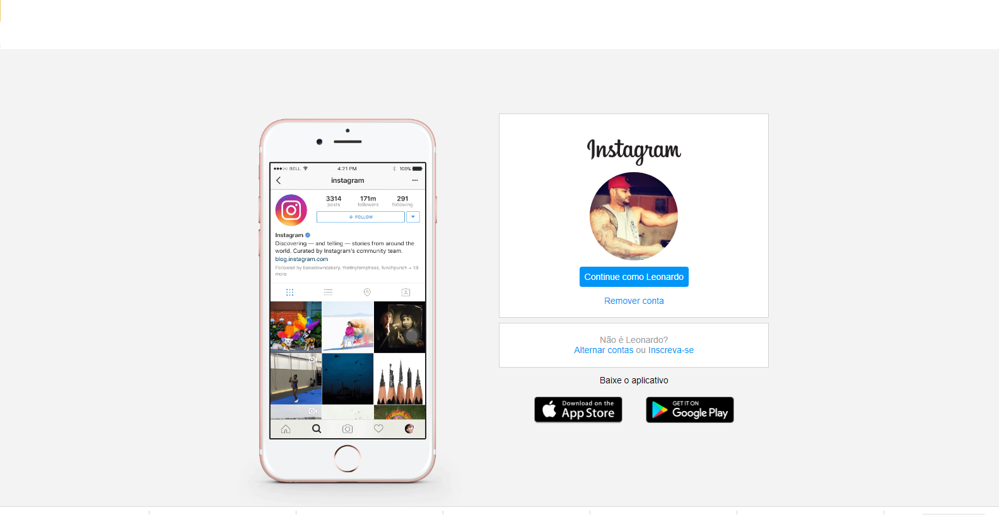

# Recriando a pagina inicial do instagram 

#### Projeto do Bootcamp Decola Dev Avanade com  desafio de reconstruir a página inicial de login do Instagram, no qual foi abordado o conceito sobre CSS utilizando Flexbox, uma metodologia de posicionamento de elementos em tela mais utilizada no mercado assim como conceitos de responsividade.

  **Apoio: Digital Innovation One /  Avanade Tecnologia**

 **Desenvolvido por Leonardo Henrique**

#### 